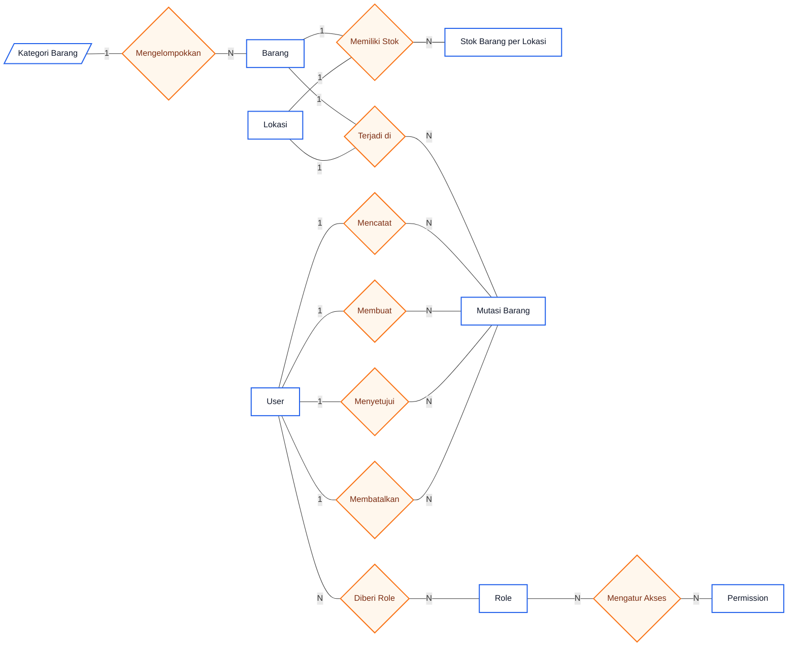
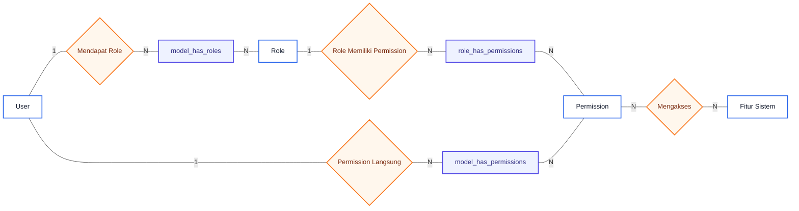
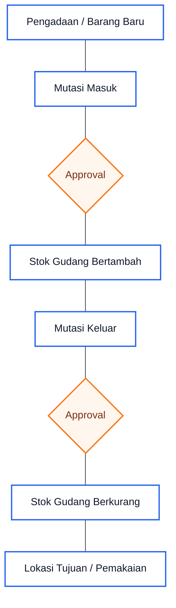

# ERD Sistem Warehouse Monitoring PT ISS

Dokumen ini adalah ERD konseptual dari project `mutasi_produk_backend`. Bentuk diagram dibuat seperti ERD presentasi: hanya menampilkan entitas dan relasi utama, tanpa detail kolom panjang di dalam tabel.

Fokus penting:

- stok barang tidak dibuat manual terlebih dahulu;
- stok terbentuk dari mutasi masuk/pengadaan barang baru;
- mutasi keluar akan mengurangi stok gudang setelah disetujui;
- sistem role dan permission memakai package Spatie Laravel Permission;
- relasi Spatie memakai pivot table: `model_has_roles`, `role_has_permissions`, dan `model_has_permissions`.

## ERD Utama Sistem Warehouse Monitoring

### Makna ERD Utama

| Relasi | Kardinalitas | Penjelasan |
|---|---:|---|
| Kategori Barang - Barang | 1:N | Satu kategori dapat mengelompokkan banyak barang. |
| Barang - Stok Barang per Lokasi | 1:N | Satu barang dapat memiliki stok di beberapa lokasi/gudang. |
| Lokasi - Stok Barang per Lokasi | 1:N | Satu lokasi/gudang dapat menyimpan stok banyak barang. |
| Barang - Mutasi Barang | 1:N | Satu barang dapat muncul pada banyak transaksi mutasi. |
| Lokasi - Mutasi Barang | 1:N | Satu lokasi/gudang dapat menjadi lokasi asal mutasi. |
| User - Mutasi Barang | 1:N | User mencatat/membuat mutasi barang. |
| User - Mutasi disetujui | 1:N | User dengan hak approval dapat menyetujui banyak mutasi. |
| User - Mutasi dibatalkan | 1:N | User dapat tercatat sebagai pembatal mutasi. |
| User - Role | N:N | Satu user bisa punya banyak role, dan satu role bisa dimiliki banyak user. Relasi ini dikelola Spatie. |
| Role - Permission | N:N | Satu role bisa punya banyak permission, dan satu permission bisa dimiliki banyak role. Relasi ini dikelola Spatie. |

## ERD Role dan Permission Spatie

Diagram ini menjelaskan relasi role-permission sesuai package Spatie Laravel Permission yang dipakai di project. Bagian ini penting karena relasi `User` ke `Role` tidak langsung memakai kolom `role_id` di tabel `users`, melainkan memakai pivot table polymorphic dari Spatie.

### Alur Kerja Role-Permission Spatie

1. Admin membuat atau mengatur `Role`, misalnya `super_admin`, `admin`, atau role lain yang dibutuhkan sistem.
2. Setiap `Role` diberi kumpulan `Permission`, misalnya akses melihat barang, membuat mutasi, mengedit lokasi, atau menyetujui mutasi.
3. User diberi role melalui pivot `model_has_roles`.
4. Saat user login ke Filament, sistem membaca role milik user.
5. Spatie mengecek permission dari role tersebut melalui pivot `role_has_permissions`.
6. Jika dibutuhkan, user juga bisa diberi permission langsung melalui `model_has_permissions`.
7. Fitur sistem hanya bisa diakses jika permission user sesuai dengan policy/resource yang dipakai aplikasi.

## Penjelasan Pivot Table Spatie

| Pivot Spatie | Menghubungkan | Fungsi |
|---|---|---|
| `model_has_roles` | `users` dengan `roles` | Menentukan role yang dimiliki user. |
| `role_has_permissions` | `roles` dengan `permissions` | Menentukan permission apa saja yang dimiliki sebuah role. |
| `model_has_permissions` | `users` dengan `permissions` | Memberikan permission langsung ke user tanpa melalui role. |

Catatan untuk relasi `model_has_roles` dan `model_has_permissions`:

- Spatie membuat relasi ini sebagai polymorphic relation.
- Karena polymorphic, pivot tidak hanya bisa dipakai oleh `User`, tetapi juga bisa dipakai model lain jika suatu saat dibutuhkan.
- Itulah sebabnya pivot memakai pasangan `model_id` dan `model_type`.
- Dalam sistem ini, `model_id` mengarah secara logis ke `users.id` saat `model_type = App\Models\User`.

## Mapping Relasi ke Tabel Database

| Konsep di ERD | Implementasi tabel di database |
|---|---|
| User | `users` |
| Role | `roles` |
| Permission | `permissions` |
| User memiliki Role | `model_has_roles` |
| Role memiliki Permission | `role_has_permissions` |
| User memiliki Permission langsung | `model_has_permissions` |
| Kategori Barang | `kategori_barangs` |
| Barang | `barangs` |
| Lokasi | `lokasis` |
| Stok Barang per Lokasi | `barang_lokasi` |
| Mutasi Barang | `mutasis` |

## Flow Mutasi Barang

### Penjelasan Flow Mutasi

- Stok muncul karena ada mutasi masuk dari pengadaan/barang baru.
- Mutasi masuk yang sudah disetujui akan menambah stok gudang.
- Mutasi keluar dibuat ketika barang akan digunakan atau dipindahkan ke lokasi tujuan.
- Mutasi keluar yang sudah disetujui akan mengurangi stok gudang.
- Approval hanya boleh dilakukan oleh user yang memiliki hak approval sesuai role/permission.

## Catatan Desain ERD

- Diagram tidak menampilkan kolom detail agar lebih mudah dibaca saat presentasi.
- Semua garis pada diagram dibuat solid, bukan garis putus-putus.
- Pivot Spatie tetap ditampilkan karena pivot tersebut adalah bagian penting dari relasi user, role, dan permission.
- Primary key tabel asli Spatie tetap menggunakan `id`, sedangkan foreign key di pivot memakai nama seperti `role_id` dan `permission_id`.
- Relasi `model_has_roles` dan `model_has_permissions` dianggap relasi logis ke `users` karena Spatie memakai konsep polymorphic.
