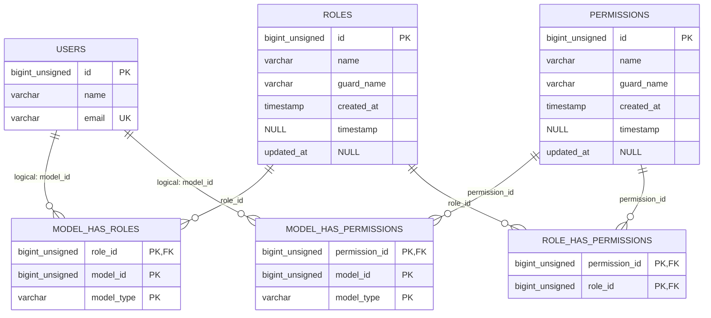

# ERD Project Mutasi Barang Backend

Dokumen ini disusun dari skema database aktual project lokal (`mutasi_backend`) dan dicocokkan dengan migration serta model Eloquent. Fokus utama aplikasi adalah master barang, master lokasi/gudang, stok per lokasi, histori mutasi stok, user, dan role/permission Filament Shield.

## ERD Domain Utama

```mermaid
erDiagram
    USERS {
        bigint_unsigned id PK
        varchar name
        varchar email UK
        timestamp email_verified_at NULL
        varchar password
        varchar remember_token NULL
        timestamp created_at NULL
        timestamp updated_at NULL
    }

    KATEGORI_BARANGS {
        bigint_unsigned id PK
        varchar nama UK
        varchar slug UK
        timestamp created_at NULL
        timestamp updated_at NULL
    }

    BARANGS {
        bigint_unsigned id PK
        varchar nama_barang
        varchar kode_barang UK
        bigint_unsigned kategori_barang_id FK "nullable, set null"
        varchar satuan
        text deskripsi NULL
        timestamp created_at NULL
        timestamp updated_at NULL
    }

    BARANG_KATEGORI_BARANG {
        bigint_unsigned kategori_barang_id PK, FK
        bigint_unsigned barang_id PK, FK
        timestamp created_at NULL
        timestamp updated_at NULL
    }

    LOKASIS {
        bigint_unsigned id PK
        varchar kode_lokasi UK
        varchar nama_lokasi
        varchar jenis_lokasi "gudang atau lokasi_pemakaian"
        text alamat NULL
        varchar keterangan NULL
        timestamp created_at NULL
        timestamp updated_at NULL
    }

    BARANG_LOKASI {
        bigint_unsigned barang_id PK, FK
        bigint_unsigned lokasi_id PK, FK
        int stok "default 0"
        timestamp created_at NULL
        timestamp updated_at NULL
    }

    MUTASIS {
        bigint_unsigned id PK
        date tanggal
        enum jenis_mutasi "masuk, keluar"
        int jumlah
        int stok_awal NULL
        int stok_akhir NULL
        varchar keterangan NULL
        varchar no_ref NULL
        enum status "pending, approved, cancelled; default pending"
        bigint_unsigned user_id FK
        bigint_unsigned barang_id FK
        bigint_unsigned lokasi_id FK
        bigint_unsigned lokasi_tujuan_id FK "nullable, set null"
        timestamp created_at NULL
        timestamp updated_at NULL
        bigint_unsigned created_by FK "nullable"
        bigint_unsigned approved_by FK "nullable, set null"
        timestamp approved_at NULL
        bigint_unsigned cancelled_by FK "nullable, set null"
        timestamp cancelled_at NULL
        varchar cancel_reason NULL
    }

    USERS ||--o{ MUTASIS : "user_id/pelaku"
    USERS ||--o{ MUTASIS : "created_by/pembuat"
    USERS ||--o{ MUTASIS : "approved_by/penyetuju"
    USERS ||--o{ MUTASIS : "cancelled_by/pembatal"

    KATEGORI_BARANGS ||--o{ BARANGS : "kategori_barang_id"
    KATEGORI_BARANGS ||--o{ BARANG_KATEGORI_BARANG : "kategori_barang_id"
    BARANGS ||--o{ BARANG_KATEGORI_BARANG : "barang_id"

    BARANGS ||--o{ BARANG_LOKASI : "barang_id"
    LOKASIS ||--o{ BARANG_LOKASI : "lokasi_id"

    BARANGS ||--o{ MUTASIS : "barang_id"
    LOKASIS ||--o{ MUTASIS : "lokasi_id/gudang terdampak"
    LOKASIS ||--o{ MUTASIS : "lokasi_tujuan_id/tujuan"
```

## Relasi Domain

| Relasi | Kardinalitas | Implementasi | Keterangan |
|---|---:|---|---|
| `users` -> `mutasis.user_id` | 1:N | FK `mutasis_user_id_foreign` | User pelaku mutasi. |
| `users` -> `mutasis.created_by` | 1:N | FK `mutasis_created_by_foreign` | User yang membuat pengajuan/record mutasi. |
| `users` -> `mutasis.approved_by` | 1:N | FK `mutasis_approved_by_foreign` | Nullable, otomatis `SET NULL` saat user penyetuju dihapus. |
| `users` -> `mutasis.cancelled_by` | 1:N | FK `mutasis_cancelled_by_foreign` | Nullable, otomatis `SET NULL` saat user pembatal dihapus. |
| `kategori_barangs` -> `barangs.kategori_barang_id` | 1:N | FK `barangs_kategori_barang_id_foreign` | Nullable, otomatis `SET NULL` saat kategori dihapus. |
| `kategori_barangs` -> `barangs` | M:N | Pivot `barang_kategori_barang` | Pivot masih aktif di model `Barang::kategoriBarangs()` dan `KategoriBarang::barangs()`. |
| `barangs` -> `lokasis` | M:N | Pivot `barang_lokasi` | Pivot menyimpan atribut `stok`. |
| `barangs` -> `mutasis` | 1:N | FK `mutasis_barang_id_foreign` | Satu barang memiliki banyak histori mutasi. |
| `lokasis` -> `mutasis.lokasi_id` | 1:N | FK `mutasis_lokasi_id_foreign` | Gudang/lokasi utama yang terdampak stok. |
| `lokasis` -> `mutasis.lokasi_tujuan_id` | 1:N | FK `mutasis_lokasi_tujuan_id_foreign` | Nullable, dipakai sebagai tujuan pada mutasi keluar/transfer. |

## Aturan Bisnis Dari Struktur

- `barang_lokasi` adalah sumber stok saat ini per kombinasi barang dan lokasi.
- Hanya lokasi dengan `jenis_lokasi = gudang` yang boleh memiliki saldo pada `barang_lokasi`.
- Lokasi dengan `jenis_lokasi = lokasi_pemakaian` hanya menjadi tujuan barang habis pakai dan tidak menerima saldo stok.
- Primary key `barang_lokasi` adalah gabungan `barang_id + lokasi_id`, sehingga satu barang hanya punya satu baris stok untuk satu lokasi.
- `mutasis` menyimpan histori pergerakan stok. `stok_awal` dan `stok_akhir` adalah snapshot stok lokasi yang terdampak pada waktu mutasi.
- `jenis_mutasi` hanya menerima `masuk` atau `keluar`.
- `status` hanya menerima `pending`, `approved`, atau `cancelled`, dengan default `pending`.
- `approved_by`, `cancelled_by`, dan `lokasi_tujuan_id` memakai `ON DELETE SET NULL`.
- FK utama seperti `mutasis.user_id`, `mutasis.barang_id`, `mutasis.lokasi_id`, dan `mutasis.created_by` memakai aturan default MySQL/Laravel, yaitu tidak otomatis cascade dan tidak set null.

## ERD Role Dan Permission

Bagian ini adalah tabel akses aplikasi yang dibuat oleh Spatie Permission dan dipakai oleh Filament Shield. Tabel ini ada di database aktual dan wajib dicatat dalam ERD karena menentukan role user, permission resource, permission widget, dan permission page.

Relasi `model_has_roles` dan `model_has_permissions` bersifat polymorphic melalui `model_type + model_id`. Dalam project ini target utamanya adalah `App\Models\User`, tetapi database tidak membuat FK fisik ke `users.id` karena tabel tersebut dapat dipakai oleh model lain juga.



### Detail Tabel Role/Permission

| Tabel | Kolom | Keterangan |
|---|---|---|
| `roles` | `id` | Primary key role. |
| `roles` | `name` | Nama role, contoh `super_admin`. |
| `roles` | `guard_name` | Guard auth, pada project ini umumnya `web`. |
| `roles` | `created_at`, `updated_at` | Timestamp role. |
| `permissions` | `id` | Primary key permission. |
| `permissions` | `name` | Nama permission, contoh `view_any_barang`, `widget_RestockRecommendation`. |
| `permissions` | `guard_name` | Guard auth, pada project ini umumnya `web`. |
| `permissions` | `created_at`, `updated_at` | Timestamp permission. |
| `model_has_roles` | `role_id` | FK ke `roles.id`. |
| `model_has_roles` | `model_id` | ID model pemilik role; untuk user berarti `users.id`. |
| `model_has_roles` | `model_type` | Class model pemilik role, contoh `App\Models\User`. |
| `model_has_permissions` | `permission_id` | FK ke `permissions.id`. |
| `model_has_permissions` | `model_id` | ID model pemilik permission langsung; untuk user berarti `users.id`. |
| `model_has_permissions` | `model_type` | Class model pemilik permission langsung, contoh `App\Models\User`. |
| `role_has_permissions` | `permission_id` | FK ke `permissions.id`. |
| `role_has_permissions` | `role_id` | FK ke `roles.id`. |

### Constraint Role/Permission

| Tabel | Key | Kolom |
|---|---|---|
| `roles` | PK | `id` |
| `roles` | UK | `name`, `guard_name` |
| `permissions` | PK | `id` |
| `permissions` | UK | `name`, `guard_name` |
| `model_has_roles` | Composite PK | `role_id`, `model_id`, `model_type` |
| `model_has_permissions` | Composite PK | `permission_id`, `model_id`, `model_type` |
| `role_has_permissions` | Composite PK | `permission_id`, `role_id` |

## Tabel Pendukung Laravel, Filament, Import, Export

```mermaid
erDiagram
    USERS {
        bigint_unsigned id PK
    }

    PERSONAL_ACCESS_TOKENS {
        bigint_unsigned id PK
        varchar tokenable_type
        bigint_unsigned tokenable_id
        text name
        varchar token UK
        text abilities NULL
        timestamp last_used_at NULL
        timestamp expires_at NULL
        timestamp created_at NULL
        timestamp updated_at NULL
    }

    NOTIFICATIONS {
        char id PK
        varchar type
        varchar notifiable_type
        bigint_unsigned notifiable_id
        text data
        timestamp read_at NULL
        timestamp created_at NULL
        timestamp updated_at NULL
    }

    IMPORTS {
        bigint_unsigned id PK
        timestamp completed_at NULL
        varchar file_name
        varchar file_path
        varchar importer
        int_unsigned processed_rows "default 0"
        int_unsigned total_rows
        int_unsigned successful_rows "default 0"
        bigint_unsigned user_id FK
        timestamp created_at NULL
        timestamp updated_at NULL
    }

    FAILED_IMPORT_ROWS {
        bigint_unsigned id PK
        json data
        bigint_unsigned import_id FK
        text validation_error NULL
        timestamp created_at NULL
        timestamp updated_at NULL
    }

    EXPORTS {
        bigint_unsigned id PK
        timestamp completed_at NULL
        varchar file_disk
        varchar file_name NULL
        varchar exporter
        int_unsigned processed_rows "default 0"
        int_unsigned total_rows
        int_unsigned successful_rows "default 0"
        bigint_unsigned user_id FK
        timestamp created_at NULL
        timestamp updated_at NULL
    }

    USERS ||--o{ IMPORTS : "user_id"
    IMPORTS ||--o{ FAILED_IMPORT_ROWS : "import_id"
    USERS ||--o{ EXPORTS : "user_id"
    USERS ||--o{ PERSONAL_ACCESS_TOKENS : "logical: tokenable"
    USERS ||--o{ NOTIFICATIONS : "logical: notifiable"
```

### Tabel Infrastruktur

Tabel berikut adalah bawaan Laravel/infrastruktur dan tidak menjadi relasi domain utama:

| Tabel | Fungsi | Key utama |
|---|---|---|
| `password_reset_tokens` | Token reset password | `email` sebagai PK |
| `sessions` | Session login | `id` sebagai PK, index `user_id`, index `last_activity` |
| `cache` | Laravel cache | `key` sebagai PK |
| `cache_locks` | Lock cache | `key` sebagai PK |
| `jobs` | Queue jobs | `id` sebagai PK, index `queue` |
| `job_batches` | Batch queue | `id` sebagai PK |
| `failed_jobs` | Queue gagal | `id` sebagai PK, `uuid` unique |
| `migrations` | Riwayat migration | `id` sebagai PK |

## Daftar Foreign Key Aktual

| Tabel | Kolom | Referensi | On Delete |
|---|---|---|---|
| `exports` | `user_id` | `users.id` | CASCADE |
| `failed_import_rows` | `import_id` | `imports.id` | CASCADE |
| `imports` | `user_id` | `users.id` | CASCADE |
| `barang_kategori_barang` | `kategori_barang_id` | `kategori_barangs.id` | CASCADE |
| `barang_kategori_barang` | `barang_id` | `barangs.id` | CASCADE |
| `model_has_permissions` | `permission_id` | `permissions.id` | CASCADE |
| `model_has_roles` | `role_id` | `roles.id` | CASCADE |
| `mutasis` | `approved_by` | `users.id` | SET NULL |
| `mutasis` | `cancelled_by` | `users.id` | SET NULL |
| `mutasis` | `created_by` | `users.id` | NO ACTION |
| `mutasis` | `lokasi_id` | `lokasis.id` | NO ACTION |
| `mutasis` | `lokasi_tujuan_id` | `lokasis.id` | SET NULL |
| `mutasis` | `barang_id` | `barangs.id` | NO ACTION |
| `mutasis` | `user_id` | `users.id` | NO ACTION |
| `barang_lokasi` | `lokasi_id` | `lokasis.id` | CASCADE |
| `barang_lokasi` | `barang_id` | `barangs.id` | CASCADE |
| `barangs` | `kategori_barang_id` | `kategori_barangs.id` | SET NULL |
| `role_has_permissions` | `permission_id` | `permissions.id` | CASCADE |
| `role_has_permissions` | `role_id` | `roles.id` | CASCADE |

## Daftar Unique Dan Composite Key Penting

| Tabel | Key | Kolom |
|---|---|---|
| `users` | Unique | `email` |
| `barangs` | Unique | `kode_barang` |
| `lokasis` | Unique | `kode_lokasi` |
| `kategori_barangs` | Unique | `nama` |
| `kategori_barangs` | Unique | `slug` |
| `barang_lokasi` | Composite PK | `barang_id`, `lokasi_id` |
| `barang_kategori_barang` | Composite PK | `kategori_barang_id`, `barang_id` |
| `roles` | Unique | `name`, `guard_name` |
| `permissions` | Unique | `name`, `guard_name` |
| `role_has_permissions` | Composite PK | `permission_id`, `role_id` |
| `model_has_roles` | Composite PK | `role_id`, `model_id`, `model_type` |
| `model_has_permissions` | Composite PK | `permission_id`, `model_id`, `model_type` |
| `personal_access_tokens` | Unique | `token` |
| `failed_jobs` | Unique | `uuid` |

## Catatan Konsistensi

- Database aktual tidak memiliki kolom `barangs.kategori`. File migration awal `2025_07_14_025632_create_barangs_table.php` masih menampilkan kolom tersebut, sehingga ada indikasi migration/source pernah berubah setelah database dimigrasi atau ada migration pembersihan yang tidak tersimpan. ERD ini mengikuti database aktual yang sedang berjalan.
- `barangs.kategori_barang_id` ada sebagai FK langsung ke `kategori_barangs`, tetapi model `Barang` juga masih memiliki relasi many-to-many ke `kategori_barangs` melalui `barang_kategori_barang`. Jadi saat ini ada dua jalur kategori yang sama-sama tersedia di struktur.
- Model `Barang::$fillable` belum memasukkan `kategori_barang_id`, walaupun kolom dan FK tersedia di database.
- `model_has_roles.model_id` dan `model_has_permissions.model_id` tidak memiliki FK fisik ke `users.id` karena tabel tersebut polymorphic. Relasi ke `users` hanya berlaku secara logis saat `model_type = App\Models\User`.
- `personal_access_tokens` dan `notifications` juga polymorphic, sehingga tidak memiliki FK fisik ke `users`.
